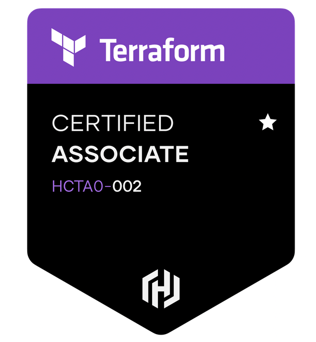
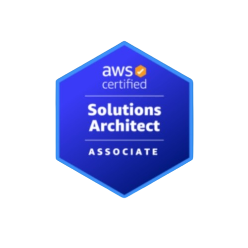

  
DevOps Engineer | AWS & Terraform  Specialist

  
Warsaw, Poland

---

### **Professional Summary**  
Cloud and DevOps professional experienced in automating infrastructure, optimizing CI/CD pipelines, and implementing cloud-native solutions. Holder of **AWS Solutions Architect** – Professional and **HashiCorp Terraform Associate** certifications

---

### **Technical Expertise**  

---

### **Professional Experience**  

  

    
  

  
<strong>DevOps Engineer</strong> | Aug 2021 – Present | Remote (Warsaw, Poland)

  <ul>
    <li>Automated AWS infrastructure provisioning using Terraform, reducing deployment times by 60%</li>
  </ul>

  

    
  

  
<strong>Platform DevOps Engineer (R&D)</strong> | Sep 2020 – Aug 2021 | Bengaluru, India

  <ul>
    <li>signed multi-cloud Kubernetes platform for 50+ microservices</li>
    <li>Implemented CI/CD pipelines reducing deployment failures by 30%</li>
  </ul>

<!-- Add other experiences in same format -->

---

### **Certifications**  

  

    
    

      <strong>AWS Solutions Architect – Professional</strong> 
      Valid until Jun 2027
    

  

  

    
    

      <strong>HashiCorp Terraform Associate</strong> 
      Valid until Dec 2025
    

  

  

    
    

      <strong>AWS Solutions Architect – Associate</strong> 
      Valid until Aug 2026
    

  

---

### **Education**  

  
  

    <strong>Visvesvaraya Technological University</strong> 
    Bachelor of Engineering (Computer Science) | 2015
  

